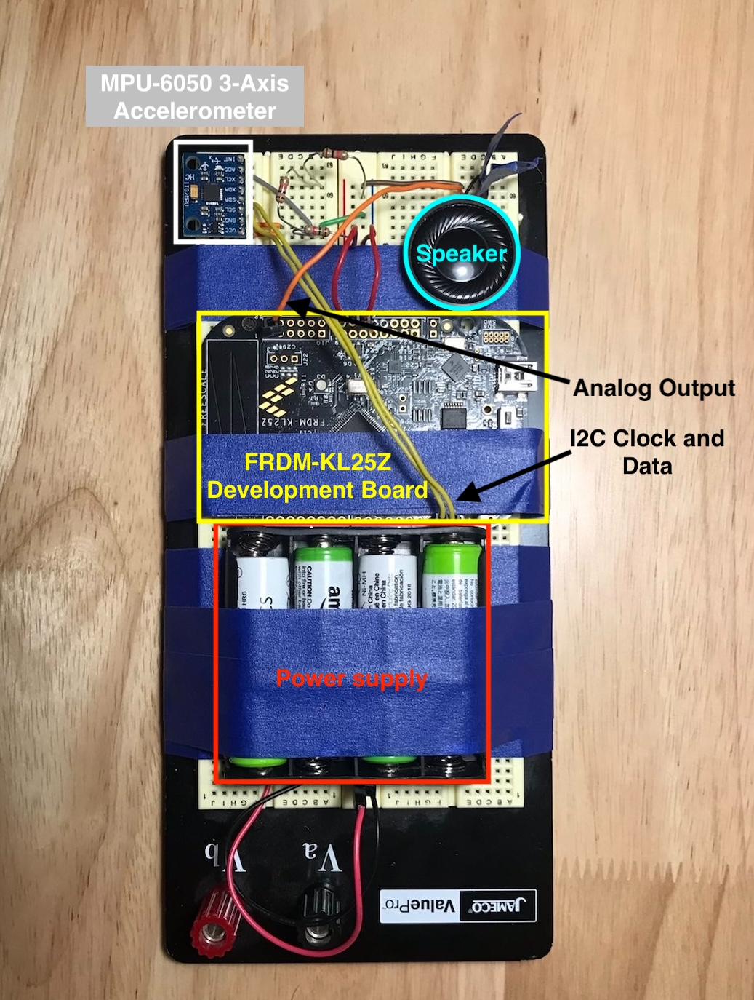

# BleepBloop

For this project, I constucted an embedded device that converts accelerometer readings into analog audio signals. The processor communicates with an MPU-6050 3-axis accelerometer over I2C, computes the magnitude of the resulting accelerometer vector, and generates audio waveforms whose frequencies are directly proportional to the acceleration magnitude. The waveform is then played out on a speaker using a digital-analog converter.

The audio output has a synthetic, computery, bleepy-bloopy sound to it, which inspired the project's name.

A short series of videos describing the device and demonstrating it in action can be found [here](https://drive.google.com/drive/folders/1UxdxhDA50sSvTJ5kP92d5pLx2ZK_xWPn?usp=sharing).

## Hardware Overview

The device was constructed by securing components to a breadboard. The primary components are the 6 V power supply, the FRDM-KL25Z microcontroller development board, the MPU-6050 accelerometer, and a small analog speaker. A 2/3 voltage divider is used to bring the power supply below the 5 V limit accepted by the accelerometer breakout board.

## Operation

The device runs some self-tests on startup. If the tests succeed, it enters the main loop, which runs at a rate of 20Hz. On each iteration of the loop, the following steps are performed

- Read the accelerometer over I2C and compute the magnitude of the 3-axis vector
- If the magnitude is less than 1.2 G, silence the speaker
- If the magnitude is greater than or equal to the threshold, map the magnitude into the frequency range (94 Hz - 2000 Hz) and generate a square waveform at that frequency. The waveform is then played out on the speaker via the digital-analog-converter.

## Rubric Questions

*Q: How did you prove that your code is correct?*

- Debug console printouts verified that good data is being received from the accelerometer over I2C.
- An online pitch detector was used to verify that the audio signals are generated at the desired frequency.
- Some integer math is required to compute the accelerometer magnitude. An automated test suite was written to verify that `Integer_SquareRoot()` behaves correctly. This test suite runs on startup.